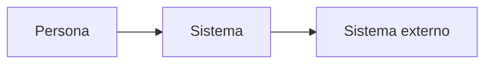
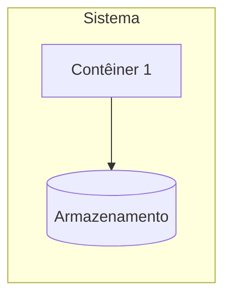

# Plano técnico

> Etapa 4 do SDD. Preenchido pelo prompt 4 a partir de `specs/spec.md`.
> Toda escolha técnica aponta para um RF/RNF ou restrição. Escolha sem origem
> fica marcada como "sem requisito correspondente".

## C4 nível 1: contexto

## C4 nível 2: contêineres

## C4 nível 3: componentes (só onde houver lógica relevante)

## Escolhas técnicas

| Escolha | Alternativas consideradas | Requisito ou restrição | ADR |
|---|---|---|---|
| | | RF-xx / RNF-xx / RES-xx | ADR-xxx |

## Ambientes (local e publicado)

## Riscos técnicos iniciais

## Perguntas abertas
