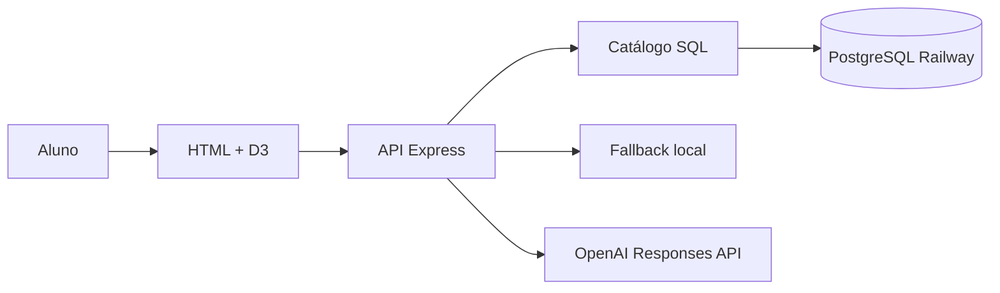
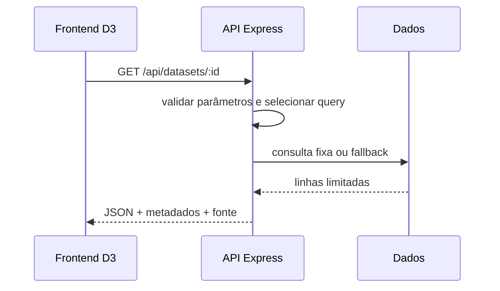

# Aula 03 — Codespaces, D3 e IA: arquitetura do laboratório

**Status:** aprovado em 27/08/2026
**Escopo:** MVP didático para a prática de 29/08/2026

## Overview

Template didático que torna explícito o fluxo pergunta → API → dados → codificação visual → decisão. O caso principal precisa funcionar em um Codespace novo, com ou sem banco e provedor de IA externos.

## Architecture

A solução possui três camadas: apresentação HTML/D3, aplicação Node/Express e dados PostgreSQL/fallback. O backend é a única fronteira autorizada a usar secrets.

### System Architecture Diagram



### Component Interaction Diagram



## Components

- **Frontend D3:** renderiza SVGs, controles, metadados e críticas; depende somente dos contratos HTTP.
- **API Express:** valida entradas, escolhe consultas, limita resultados e serve arquivos estáticos.
- **Catálogo SQL:** contém quatro consultas fixas/parametrizadas; não aceita SQL do usuário ou do modelo.
- **Adaptador PostgreSQL:** pool pequeno, TLS, timeout e encerramento seguro.
- **Fallback local:** amostras sem credenciais que preservam os quatro contratos.
- **Assistente:** usa a Responses API opcionalmente e sempre possui crítica heurística local.

## Data Flow

```text
controle do aluno -> GET /api/datasets/:id -> validação -> catálogo SQL
                                                     |-> PostgreSQL Railway
                                                     |-> fallback local
JSON analítico -> D3 -> SVG + metadados -> resumo -> POST /api/agent
                                                -> OpenAI ou crítica local
                                                -> recomendação revisável
```

## Integration

- **GitHub Codespaces:** executa o dev container Node 22 e encaminha a porta 3000.
- **Railway PostgreSQL:** conexão TLS por `DATABASE_URL` e papel somente leitura.
- **OpenAI Responses API:** integração opcional por `OPENAI_API_KEY`; recebe somente resumo validado.

## Configuration

O schema YAML em `config/aula_03_codespaces_d3_ia.yaml` define porta, pool, timeout, limites, modelo e fallback. Secrets e overrides operacionais usam variáveis de ambiente documentadas em `.env.example`.

```yaml
server:
  port: 3000
database:
  pool_max: 5
  statement_timeout_ms: 5000
  ssl: true
api:
  max_rows: 500
  request_timeout_ms: 8000
agent:
  enabled: true
  model: gpt-5-mini
  max_output_tokens: 500
lab:
  fallback_data: true
```

## Deployment

O alvo didático é um Codespace por aluno, iniciado por `npm run lab:aula03`. Para dados sensíveis, o backend deve migrar para um serviço centralizado e o Codespace deve conter apenas o frontend.

## Security

As barreiras são defesa em profundidade: secrets apenas no backend, papel PostgreSQL read-only, SQL allowlist, validação estrita, limite de payload/linhas, erros sanitizados e IA sem ferramentas de banco.

## Performance

Pool máximo de cinco conexões, timeout de consulta de cinco segundos, timeout HTTP de oito segundos e máximo de 500 linhas. O D3 recebe dados já delimitados.

## Monitoring

`GET /api/health` expõe apenas os estados sanitizados da aplicação, banco e IA. A inicialização gera log JSON sem valores de secrets; erros de cliente não recebem stack trace.

## Testing

Testes Node cobrem contratos, allowlists, limites, fallback, agente e ausência de secrets. Playwright valida quatro SVGs, interação, erros de console e overflow em desktop/mobile.

## Decisão

O laboratório será executado em GitHub Codespaces. O navegador renderiza quatro visualizações com D3; uma API Node.js no mesmo Codespace executa somente consultas PostgreSQL pré-cadastradas. A conexão com o PostgreSQL Olist do Railway existe apenas no backend. Um assistente de IA critica decisões visuais a partir de resumos dos dados e nunca recebe ferramenta de SQL livre.

```text
Navegador (HTML + D3)
        |
        | mesma origem: /api/*
        v
API Node.js no Codespace
   |                 |
   | SQL allowlist   | resumo + metadados
   v                 v
PostgreSQL Olist   OpenAI Responses API
no Railway         (opcional)
```

## Alternativas consideradas

| Opção | Vantagem | Limitação | Decisão |
|---|---|---|---|
| Continuar somente com Metabase | Menor atrito operacional | Esconde parte da codificação visual | Mantido como referência, não como laboratório principal da Aula 03 |
| HTML conectando diretamente ao PostgreSQL | Poucos componentes | Expõe credencial e protocolo do banco ao navegador | Rejeitada |
| Codespaces + API + D3 + IA | Expõe o fluxo completo e permite versionar o artefato | Exige template pronto | Escolhida |

## Fluxo principal

1. O aluno abre o Codespace e executa `npm run lab:aula03`.
2. O frontend solicita um dos quatro datasets por identificador conhecido.
3. A API valida parâmetros, escolhe SQL da allowlist e executa uma consulta parametrizada com limite e timeout.
4. Sem `DATABASE_URL`, a API usa dados demonstrativos locais para que o laboratório continue funcional.
5. O D3 desenha evolução, distribuição, magnitude e relação.
6. O aluno altera granularidade, bins, Top N e tratamento de outliers.
7. O assistente recebe apenas estatísticas resumidas e a decisão visual. Com `OPENAI_API_KEY`, usa a Responses API; sem chave, devolve um roteiro crítico local.

## Contratos da API

- `GET /api/health` — informa disponibilidade da API, banco e IA sem revelar segredos.
- `GET /api/datasets/evolution?grain=day|week|month`
- `GET /api/datasets/distribution?bins=5..40`
- `GET /api/datasets/magnitude?top=5..20`
- `GET /api/datasets/relation?trimOutliers=true|false&limit=50..500`
- `POST /api/agent` — recebe `chartId`, `decision` e `summary`; devolve `observation`, `caution` e `suggestion`.

## Segurança

- `DATABASE_URL` e `OPENAI_API_KEY` são Codespaces Secrets; nunca chegam ao navegador.
- O banco deve usar papel exclusivo somente leitura, TLS, `statement_timeout` e acesso apenas às tabelas/views Olist necessárias.
- Não existe endpoint de SQL arbitrário. Todos os valores variáveis são parâmetros ou enums validados.
- Respostas são limitadas; erros não incluem SQL, stack trace ou credenciais.
- Textos vindos da API são inseridos na interface como texto, não como HTML.
- A IA não recebe credenciais, nomes internos de conexão nem linhas completas do banco.

## Configuração

Valores mutáveis ficam em `config/aula_03_codespaces_d3_ia.yaml`; segredos ficam somente em variáveis de ambiente. A ordem é variável de ambiente sobre YAML sobre padrão seguro.

## Estratégia de testes

- Testes unitários dos validadores e do catálogo de consultas.
- Testes HTTP dos endpoints usando o fallback local, sem banco ou chave externa.
- Teste manual em Codespaces: iniciar com um comando, abrir a porta 3000 e manipular os quatro controles.
- Teste opcional de integração com Railway usando papel read-only.

## Preservação de capacidade

Metabase e seus materiais anteriores não são removidos. A Aula 03 ganha um laboratório versionável equivalente às quatro perguntas salvas. As referências da Aula 03 e da home passam a explicar o novo ambiente; as demais aulas continuam inalteradas.

## Riscos e mitigação

| Risco | Mitigação |
|---|---|
| Falha/latência do Railway | Dataset local de fallback e health check |
| Chave de IA ausente | Crítica heurística local |
| Vazamento de credencial | Secrets, backend-only e role read-only |
| Consulta pesada | SQL allowlist, timeout, limites e pool pequeno |
| Escopo maior que 2h10 | Template pronto; alunos trabalham nas decisões visuais |

## Validação

- Product Owner: aprovado com redução de escopo para template pronto.
- Arquitetura/dados: aprovado com backend obrigatório, SQL allowlist e IA sem SQL livre.
- Usuário: escolheu explicitamente GitHub/Codespaces em 27/08/2026.
